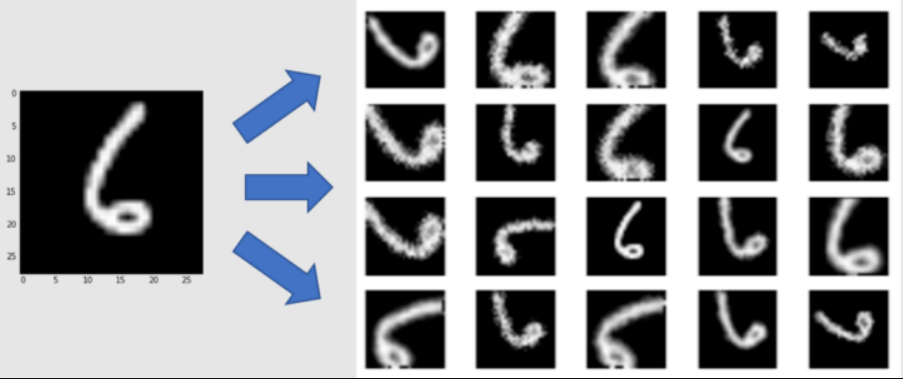
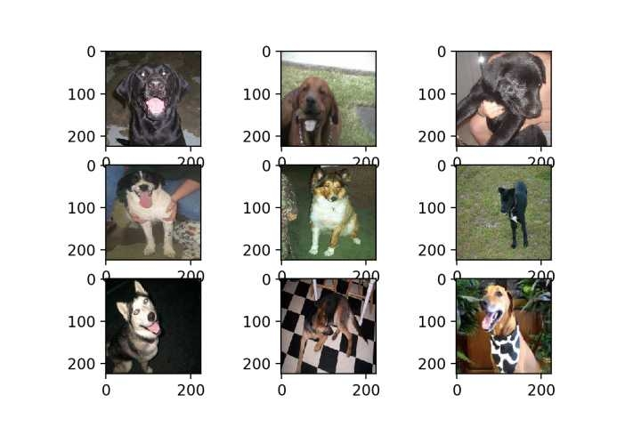
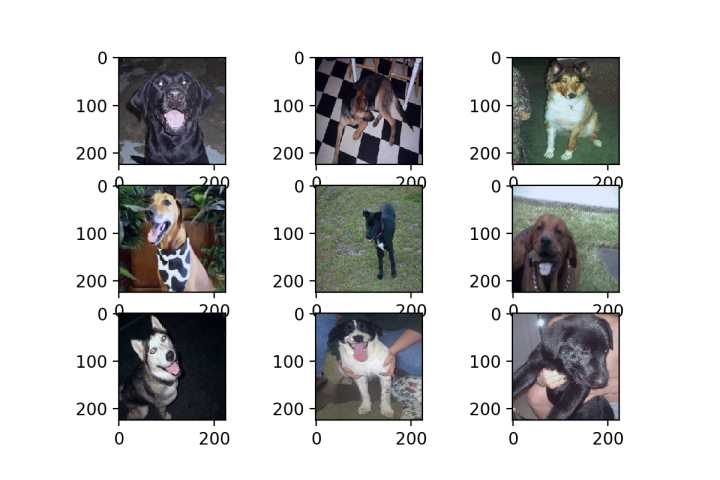

# 数据处理

## 1  数据增强（data augmentation）

#### 1.1  数据增强的作用

- 增大dataset，提高模型的泛化能力，对防止过拟合起到一定作用。
- 增加噪声干扰数据，提升模型的鲁棒性
- 通过增强从原始数据集中提取出更多的信息，使得增强后的数据集代表更为全面的数据集合，进而缩小训练集和验证集之间的差距。

#### 1.2  数据增强的方法

- 随机旋转

- 随机反转

- 随机平移

- 随机裁剪

  

#### 1.3  数据增强的分类

##### 1.3.1  离线增强

离线数据增强的特点是预先对已有数据集进行所有必要的变换，使得增强后的数据数量变为原始数据数量的N倍（N为增强因子）。

离线数据增强的主要考虑因素是与扩增数据带来的额外内存和计算约束。因此，这种方式更适用于小数据集。

##### 1.3.2  在线增强

在线数据增强的特点是不需要预先对已有数据集进行所有必要的变换。而是在训练阶段，在线的对图像进行各类转换。

因为每种数据增强方式都包含一个随机因子，那么下一次epoch的训练数据就会生成一批新的数据。只要训练的epoch 够大，就等价于扩充了原始数据集的N倍数量（N为增强因子）。

在线增强的优点是节省内存空间、不需要额外进行数据预处理。在线增强的缺点是会降低训练速度。

#### 1.4  项目中数据增强的实现

项目中采用了 keras 提供的 ImageDataGenerator 类，通过这个类可以通过实时数据增强生成张量图像数据批次，并且可以循环迭代。 ImageDateGenerator() 是一个图片生成器，负责生成一个批次一个批次的图片，以生成器的形式给模型训练，同时对每个批次的训练图片，适时地进行数据增强处理。

项目中的 ImageDataGenerator 类的构造函数如下：

```python
from keras.preprocessing.image import ImageDataGenerator
# enlarge dataset
datagen = ImageDataGenerator(
    rotation_range=15,
    width_shift_range=0.1,
    height_shift_range=0.1,
    horizontal_flip=True,
    featurewise_center=True,
    featurewise_std_normalization=True,
    validation_split=0.2
)

# standardize test data
standardizer = ImageDataGenerator(
    featurewise_center=True,
    featurewise_std_normalization=True
)
```

参数设计与解释：

​		rotation_range：随机旋转的度数范围，15度表示随机旋转最大的角度为15度。

​		width_shift_range / height_shift_range：随机水平、垂直平移范围，0.1表示最大平移距离为0.1倍的图像宽度。

​		horizontal_flip：布尔值，设为 True 表示随机对图片执行水平翻转操作。

​		featurewise_center：布尔值，设为 True 表示使数据集去中心化（使得其均值为0）。

​		featurewise_std_normalization：布尔值，设为 True 表示将输入的每个样本除以其自身的标准差。两个 featurewise 函数从数据集整体上对每张图片进行了标准化处理。





上面两张图片是进行 featurewise 标准化前后的对比，可见 featurewise 后，几张高亮的图片在视觉上变暗了一点，整体亮度更均衡。


划分数据集之后，通过 fit 方法对样本数据进行数据增强，之后通过 flow 方法进行训练。相关代码如下：

```python
# enlarged training set, and standardize whole dataset. 
    datagen.fit(x_train)
    standardizer.fit(x_train)

    model.fit(x=datagen.flow(x_train, y_train, subset='training'),
		validation_data=datagen.flow(x_train, y_train, subset='validation'),
        verbose=1, callbacks=callbacks, epochs=epochs)
```


## 2  标签向量化处理

#### 2.1  独热编码（One-Hot Encoding）

##### 2.1.1  使用 one-hot 编码的原因

在机器学习算法中，我们会遇到分类特征，但大部分特征值不是连续的，是离散的、无序的。如果要作为机器学习算法的输入，通常我们需要对其进行特征数字化。

##### 2.1.2 one-hot 编码概述

独热编码，又称为一位有效编码，主要是采用N位状态寄存器来对N个状态进行编码，每个状态都由他独立的寄存器位，并且在任意时候只有一位有效。

也就是说，one hot 编码是将类别变量转换为机器学习算法易于利用的一种形式的过程。

##### 2.1.3 one-hot 编码优优缺点

##### 优点

​		解决了分类器不好处理离散数据的问题。使用 one-hot 编码，将离散特征的取值扩展到了欧式空间，离散特征的某个取值就对应欧式空间的某个点。会让特征之间的距离计算更加合理。

​		在一定程度上也起到了扩充特征的作用。

##### 缺点

​		是一个词袋模型，不考虑词与词之间的顺序并且相互独立。（在文本特征中缺点突出）

​		得到的特征是离散稀疏的。

#### 2.2  标签向量化（categorical）

##### 2.2.1  to_categorical 的功能

简单来说，to_categorical 就是将类别向量转换为二进制（只有0和1）的矩阵类型表示。其表现为将原有的类别向量转换为独热编码的形式。

##### 2.2.2  项目实现

多类分类问题与二类分类问题类似，需要将类别变量（categorical function）的输出标签转化为数值变量。

在多分类问题中我们将转化为虚拟变量（dummy variable）：即用one hot encoding方法将输出标签的向量（vector）转化为只在出现对应标签的那一列为1，其余为0的布尔矩阵。

```python
def load_processed_cifar10():
    (x_train, y_train), (x_test, y_test) = cifar10.load_data()

    # categorical
    y_train = np_utils.to_categorical(y_train, 10)
    y_test = np_utils.to_categorical(y_test, 10)

    return (x_train, y_train), (x_test, y_test)
```

对网络的结构的影响：

```python
# 同时在网络中，损失函数对应选择 categorical_crossentropy
    model.compile(loss='categorical_crossentropy',
                    optimizer=Adam(learning_rate=1e-3), 
                    metrics=['accuracy'])
```

