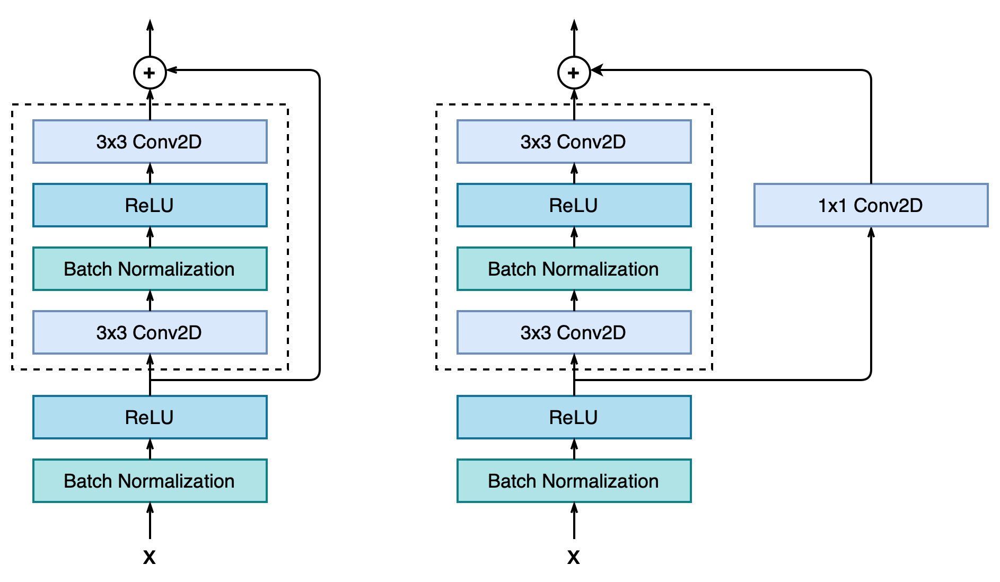
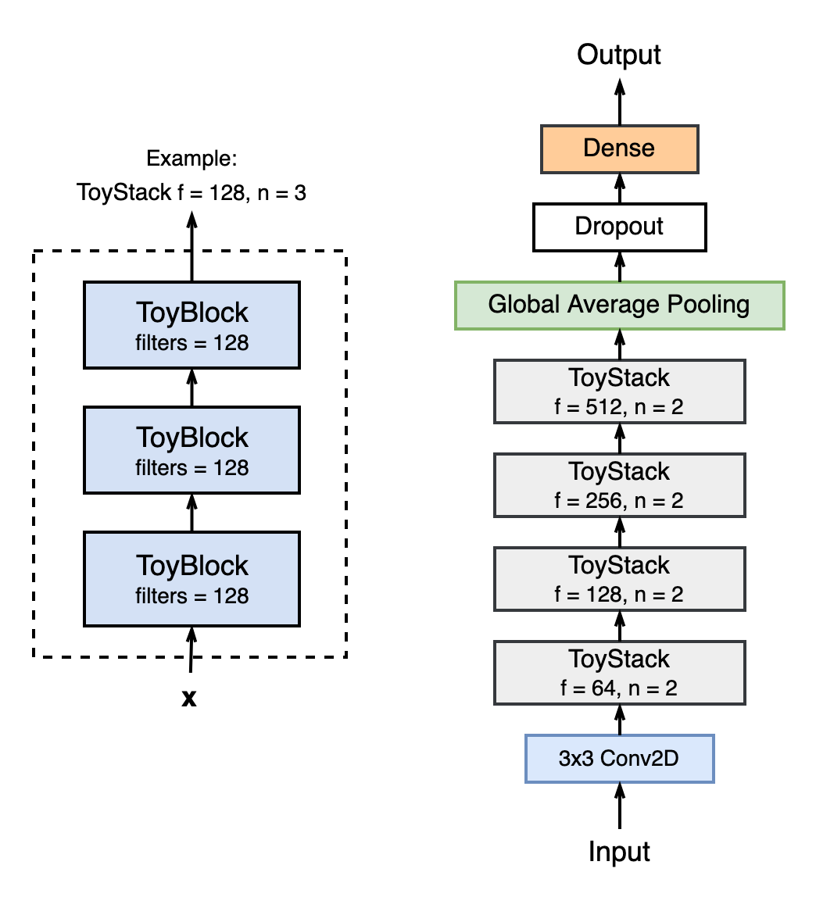

# 系统设计

关于**ToyNet**的完整实现，可以到[GitHub仓库](https://github.com/JolyneFr/toynet)查看

## 模型设计

### 概述

**ToyNet**的主要灵感来源于**ResNet**([Deep Residual Learning for Image Recognition](https://arxiv.org/abs/1512.03385))，其思路是通过加入shortcut路径，使更深层的网络层能够学习到上层的原始函数。单元block的实现上参考了BasicBlock，没有参考BottleneckBlock的原因是目标数据集较为简单，没必要使用为更深层神经网络优化的BottleneckBlock。

由于测试准确率还有上升空间，在阅读了关于**ResNet**的网络层优化的另一篇文章([Identity Mappings in Deep Residual Networks](https://arxiv.org/abs/1603.05027))后，采用了其中提到的 pre-activation 优化。

为了解决训练过程中Loss曲线显示的过拟合问题，在卷积层和全连接层上加入了`Dropout`，提高了**ToyNet**在不同数据之间的泛化能力。

针对*CIFAR10*数据集，我们还额外调整了网络层数，有**ToyNet18**和**ToyNet14**两个版本。

### 具体实现

网络中的最基本模块是**ToyBlock**，根据shortcut是否包含卷积层分为两类。其中shortcut包含卷积层的**ToyBlock**用于调整通道数，以便进行与主路进行相加运算。相比于普通CNN中的 *Conv->BN->ReLU*结构，pre-activation优化后的结构为*BN->ReLU->Conv*。



典型的CNN（比如VGG、ResNet、DenseNet、EfficientNet...）都是让通道数随着网络的加深而逐渐翻倍的，因此**ToyNet**也效仿了这样的做法，将卷积层通道数相同的**ToyBlock**由统一的结构**ToyStack**聚合在一起管理。

下图左侧描述了**ToyStack**的结构，右侧是**ToyStack18**的全局结构。



**ToyStack14**的block_num配置调整为[1, 2, 2, 1]。

## 训练方法

**ToyNet**的训练中有如下要点，训练细节参考源代码中的`train.py`

### 数据增强与标准化

使用了`keras.preprocessing`中提供的图像数据集生成器`ImageDataGenerator`对原有的CIFAR10进行数据增强：包括对图像进行旋转、平移、水平翻转。并且还对0～255的RGB数据进行了z-score处理，便于训练。

此外，从测试集中专门分出了20%的数据用于validation。

```python
datagen = ImageDataGenerator(
    rotation_range=15,
    width_shift_range=0.1,
    height_shift_range=0.1,
    horizontal_flip=True,
    featurewise_center=True,
    featurewise_std_normalization=True,
    validation_split=0.2
)
```

### 条件性学习率衰减

当训练过程中某一指标（这里使用`val_loss`）一直处于平台期时，以某一倍数降低学习率，从而优化训练过程，据说在实践中很有用。

```python
ReduceLROnPlateau(factor=0.15, monitor='val_loss', patience=5)
```

### 余弦衰减学习率

在正常训练过程中采用了余弦学习率。相比于指数衰减学习率，余弦衰减的速度更慢，因此能在前期更好的寻找全局最优而非直接进入局部最优。

```python
LearningRateScheduler(
    CosineDecay(
        initial_learning_rate=1e-3, 
        decay_steps=epochs))
```
除此之外，我们还尝试了其他许多种学习率衰减策略（指数衰减、含重启的余弦退火学习率等）。

### 优化器

选用了经验上效果最好的`Adam Optimizer` ([Adam: A Method for Stochastic Optimization](https://arxiv.org/abs/1412.6980))

### Loss函数与指标

选用了`categorical_crossentropy`作为Loss函数，`accuracy`作为训练时的指标。
