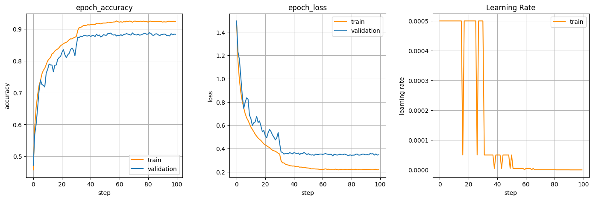

# CNN Image Classifier: ToyNet
Team Members: 杨镇宇, 潘浩楠, 李卓龙

本项目主要致力于探索各种对模型的修改和训练方法的调整如何影响CNN。为此，我们构建了一个基于`ResNet`的残差神经网络：`ToyNet`，在之上针对*CIFAR10*数据集进行训练和测试。


`ToyNet`这个轻量级的残差神经网络允许我们对其进行模块化的修改和超参数调整，**Keras**提供的简明API也为整个实验过程带来方便，这些会在之后的章节详细介绍。我们先从数据预处理开始。

## 数据处理

这是独立于模型设计与训练之外的步骤，是图像识别的第一步。

### 数据增强（Data Augmentation）

> *CIFAR10*的数据量为$32 * 32 * 3 * 60000$，其中50000张训练集，10000张测试集。
> 较小的尺寸加上较少的图片数，必须进行**数据增强**才能让数据量达到有利于训练的水准。

在使用CNN进行图像识别时，数据增强的有以下作用：

- 增大dataset，提高模型的泛化能力，防止过拟合。
- 增加噪声干扰数据，提升模型的鲁棒性
- 通过增强从原始数据集中提取出更多的信息，使得增强后的数据集代表更为全面的数据集合，进而缩小训练集和验证集之间的差距。

项目中采用了**Keras**提供的`ImageDataGenerator`类，通过这个类可以通过实时数据增强生成张量图像数据批次，并且可以循环迭代。`ImageDateGenerator()`是一个图片生成器，负责生成一个批次一个批次的图片，以生成器的形式给模型训练，同时对每个批次的训练图片，适时地进行数据增强处理。

实际的数据增强代码如下：其中的`datagen`负责增强并标准化**训练集**，`standardizer`则把同样的标准化参数应用于**测试集**，以保证训练和测试集处理过程的一致性。

```python
from keras.preprocessing.image import ImageDataGenerator
# enlarge dataset
datagen = ImageDataGenerator(
    rotation_range=15,
    width_shift_range=0.1,
    height_shift_range=0.1,
    horizontal_flip=True,
    featurewise_center=True,
    featurewise_std_normalization=True,
    validation_split=0.2
)

# standardize test data
standardizer = ImageDataGenerator(
    featurewise_center=True,
    featurewise_std_normalization=True
)
```

参数设计与解释：

+ `rotation_range`：随机旋转的度数范围。
+ `width_shift_range / height_shift_range`：随机水平、垂直平移范围，单位为图像宽度。
+ `horizontal_flip`：布尔值，设为 True 表示随机对图片执行水平翻转操作。
+ `featurewise_center`：布尔值，设为 True 表示使数据集去中心化（使得其均值为0）。
+ `featurewise_std_normalization`：布尔值，设为 True 表示将输入的每个样本除以其自身的标准差。两个 featurewise 函数从数据集整体上对每张图片进行了标准化（*Z-Score*）处理。
+ `validation_split`：将训练集的一部分单独分出作为验证集，之后详细说明

一张图片经过以上的**随机旋转、随机反转、随机平移**可能得到如下结果：


然后可以将两个`ImageDataGenerator`对象作用于`x_train`，以便之后完成标准化：

```python
# enlarged training set, and standardize whole dataset. 
datagen.fit(x_train)
standardizer.fit(x_train)
```

###  标签向量化处理

多类分类问题与二类分类问题类似，需要将类别变量（*categorical function*）的输出标签转化为数值变量。

在多分类问题中我们将转化为虚拟变量（*dummy variable*）：即用`one-hot-encoding`方法将输出标签的向量转化为只在出现对应标签的那一列为1，其余为0的布尔矩阵。

```python
from keras.datasets import cifar10
from keras.utils import np_utils

def load_processed_cifar10():
    (x_train, y_train), (x_test, y_test) = cifar10.load_data()
    # make label categorical
    y_train = np_utils.to_categorical(y_train, 10)
    y_test = np_utils.to_categorical(y_test, 10)
    return (x_train, y_train), (x_test, y_test)
```

对网络的结构的影响：

```python
# 同时在网络中，损失函数对应选择 categorical_crossentropy
model.compile(loss='categorical_crossentropy', ...)
```

## 系统设计

关于**ToyNet**的完整实现，可以到[GitHub仓库](https://github.com/JolyneFr/toynet)查看最新的版本（不一定是acc最高的）。

### 模型设计

> Slides指导我们要站在巨人的肩膀上，所以我们选了个100,000+引用的肩膀。

#### 概述

**ToyNet**的主要灵感来源于**ResNet**([Deep Residual Learning for Image Recognition](https://arxiv.org/abs/1512.03385))，其思路是通过加入shortcut 路径，使更深层的网络层能够学习到上层的原始函数。单元block的实现上参考了BasicBlock，没有参考BottleneckBlock 的原因是目标数据集较为简单，没必要使用为更深层神经网络优化的 BottleneckBlock。

由于测试准确率还有上升空间，在阅读了关于**ResNet**的网络层优化的另一篇文章([Identity Mappings in Deep Residual Networks](https://arxiv.org/abs/1603.05027))后，采用了其中提到的 pre-activation 优化。~~事实上该优化对于层数更深的残差网络（比如ResNet152）作用才比较明显，这里只是尝试一下。~~

为了解决训练过程中Loss曲线显示的过拟合问题，在全连接层上加入了`Dropout`，提高了**ToyNet**在不同数据之间的泛化能力。（过程中也尝试了在卷积层加dropout的无理操作）

针对*CIFAR10*数据集，我们还额外调整了网络层数，有**ToyNet18**和**ToyNet14**两个版本。

#### 具体实现

网络中的最基本模块是**ToyBlock**，根据shortcut是否包含卷积层分为两类。其中shortcut包含卷积层的**ToyBlock**用于调整通道数，以便进行与主路进行相加运算。相比于普通CNN中的 *Conv->BN->ReLU*结构，pre-activation优化后的结构为*BN->ReLU->Conv*。


典型的CNN（比如VGG、ResNet、DenseNet、EfficientNet...）都是让通道数随着网络的加深而逐渐翻倍的，因此**ToyNet**也效仿了这样的做法，将卷积层通道数相同的**ToyBlock**由统一的结构**ToyStack**聚合在一起管理。

在网络最后，相对于传统的`AveragePooling + Flatten`，使用了论文 [Network In Network](https://arxiv.org/abs/1312.4400) 中提出的`GlobalAveragePooling`结构，被认为能够提供更好的过拟合抗性。

下图左侧描述了**ToyStack**的结构，右侧是**ToyStack18**的全局结构。


**ToyStack14**的block_num配置调整为[1, 2, 2, 1]。

### 训练方法

**ToyNet**的训练中有如下要点，训练细节参考源代码中的`train.py`

#### 数据增强、划分与标准化

数据增强在**第一部分：数据处理**中已经提到过了，这里主要介绍数据划分。

原始的*CIFAR10*数据集只分为了`train`和`test`两个集合，但是从语义层面考虑，CNN模型在训练时不应得知任何有关测试集的信息，因此我们单独从测试集中分割出$20\%$作为验证集（*validation*），用以在模型训练过程中验证准确率和Loss大小，从而观察模型的泛化能力。测试集只在模型训练完后的`evaluate`阶段使用。

```python
datagen = ImageDataGenerator(..., validation_split=0.2)
# split to 2 subset: training & validation
traing_data = datagen.flow(x_train, y_train, subset='training')
validation_data = datagen.flow(x_train, y_train, subset='validation')
...
# only use test_data when evaluating model
scores = model.evaluate(standardizer.flow(x_test, y_test), verbose=1)
```

#### 条件性学习率衰减

当训练过程中某一指标（这里使用`val_loss`）一直处于平台期时，以某一倍数降低学习率，从而优化训练过程，据说在实践中很有用。

```python
ReduceLROnPlateau(factor=0.15, monitor='val_loss', patience=5)
```

下面是一段指数型(*ExponentialDecay*)学习率/epoch曲线，中间下降的点发生了条件性学习率衰减。


#### 余弦衰减学习率

在正常训练过程中采用了余弦学习率。相比于指数衰减学习率，余弦衰减的速度更慢，因此能在前期更好的寻找全局最优而非直接进入局部最优。

```python
LearningRateScheduler(CosineDecay(initial_learning_rate=1e-3))
```
除此之外，我们还尝试了其他许多种学习率衰减策略（指数衰减、含重启的余弦退火学习率等）。这些会在**调参实验和结果分析**中详述

#### 学习策略

选用了经验上效果最好的`Adam Optimizer` ([Adam: A Method for Stochastic Optimization](https://arxiv.org/abs/1412.6980))。这是一种可以替代传统随机梯度下降过程的一阶优化算法，它能基于训练数据迭代地更新神经网络权重，通过计算梯度的一阶矩估计和二阶矩估计而为不同的参数设计独立的自适应性学习率。

> 总而言之就是效果很好，应该。

#### Loss函数与指标

选用了`categorical_crossentropy`作为Loss函数，`accuracy`作为训练时的指标。这部分的设计比较一般化，项目结束后有时间时可能会尝试`focal_loss`的效果，但是期末考试实在复习不完了。

## 实验结果

事实上，我们花在训练+调参的时间比构建模型多得多。

### 预测准确率

由于**ToyNet**基本上脱胎于残差神经网络，因此将**ResNet**在*CIFAR10*数据集上的结果作为实验的baseline是一件很自然的事情。为此，我们实现了一个符合[原始论文](https://arxiv.org/abs/1512.03385)参数与设计的轻量级残差神经网络：**PureResNet**。

**PureResNet**的实现在`toynet/pure_model`中，有**PureResNet18, 34, ..., 152**多种网络层数的版本。为了适应*CIFAR10*的低数据量，选用18层的网络作为baseline，训练100个epoch后测得：

```shell
Test accuracy: 92.440% Test Loss: 0.438
```


以此为依据，可以预测**ToyNet**在*CIFAR10*上的表现：

+ 为防止过拟合，采用的**ToyNet**层数小于18层，因此最终的准确率可能不会优于**PureResNet**
+ 前提同上，**ToyNet**由此能拥有更强的泛化能力，我们有理由期待Test Loss值低于baseline

### 训练过程：调参实验及结果分析

> **模型训练**和**调参**是紧密相关、相互耦合的，把这两部分放在一起能使报告逻辑更顺畅。

调整模型有两个主要目标：**提升预测准确率**和**增强泛化能力**。为此，实验中对以下参数/结构进行过调整：

+ 修改卷积层和全连接层的总数量（50、34、18、14）
+ 修改各层卷积核数量（[16, 32, 64, 128]、[32, 64, 128, 256]、[64, 128, 256, 512]）
+ 向神经网络中加入Dropout层（卷积层（尝试性）和全连接层）和修改Dropout概率
+ 调整卷积层、BN层、ReLU层的顺序（灵感来自论文）
+ 在训练中尝试不同种类和参数的学习率曲线（阶梯形、指数下降、余弦退火、余弦重启）

接下来按照实验过程中的调整顺序叙述我们的调参过程和结果分析。

由于每次尝试训练时间较长，为了提高效率，可能会出现**一次调整多个参数 / 提前手动终止效果不佳的训练**的情况。我们将在叙述中尽量分析多个参数各自造成的结果，以及说明提前手动终止的原因。

#### 初始模型 toynet20_init

这是参考**ResNet20**的原始实现，阶梯下降型学习率**[1e-3, 1e-4, 1e-5]**，没有Dropout层。
网络各阶段卷积核数量：**[16, 32, 64, 128]**；各阶段**ToyBlock**数量：**[2, 2, 2, 2]**

> Recall: **ToyBlock**是**ToyNet**的最基础模块，包含了两个卷积层
> 因此**ToyBlock**的数量越多，网络层数越深，CNN包含的参数量越多

**训练结果：**
```shell
Test accuracy: 89.443% Test Loss: 0.3391
```


最左侧是`epoch_accuracy`曲线，描述每个epoch结束时模型在训练/验证集上的准确率；中间的`epoch_loss`曲线是各epoch中*Cross Entropy Loss*的值；最右侧可以看到每个epoch采用的学习率*Learning Rate*。之后的迭代不再对每张图片的曲线含义进行重复说明。

**结果分析：**观察到40个epoch前**验证集的acc和loss不稳定**，根据上课讲解的知识，这是**学习率过大**导致模型在参数空间的最优值上方**反复横跳**造成的；因此，可以解释为什么40个epoch**学习率阶梯下降**后训练集和验证集的**accuracy**和**loss**都有显著的优化，并且曲线变得平滑。这说明了**初始学习率对于该模型来说过高**。

**参数调整：**降低阶梯型学习曲线的初始学习率

#### 减半初始学习率模型 toynet20_half_lr

将学习率减半后，阶梯下降型学习率**[5e-4, 5e-5, 1e-5]**，没有Dropout层。
网络各阶段卷积核数量：**[16, 32, 64, 128]**；各阶段**ToyBlock**数量：**[2, 2, 2, 2]**

**训练结果：**
```shell
Test accuracy: 88.343% Test Loss: 0.3476
```


**结果分析：**缩小初始学习率后，观察到初始训练曲线（*Accuracy*以及*Loss*）的抖动情况有所缓解，但是学习率调小导致100个epoch时的最终*Test Accuracy*有所下降，有可能是**过小的学习率使得模型未达到收敛状态**。
另外注意到，在准确率曲线的平缓区（60个epoch之后），训练集和验证集的准确率一直有稳定的差距。我们认为这可能是**模型的泛化能力不足**导致**不能将训练集上的普遍特征提取出来**，因此，决定在下一个迭代模型加入Dropout层，以此**减少过拟合**，以提高泛化能力。

**参数调整：**尝试在**ToyNet**的全连接部分加入Dropout层，并适当回升学习率。

#### 可泛化模型：toynet20_with_dropout

全连接层加入了参数$\alpha=0.5$的Dropout层，保持阶梯下降型学习率**[7e-4, 27e-5, 27e-6]**。
网络各阶段卷积核数量：**[16, 32, 64, 128]**；各阶段**ToyBlock**数量：**[2, 2, 2, 2]**

**训练结果：**
```shell
Test accuracy: 88.457% Test Loss: 0.3349
```


**结果分析：**肉眼可见的是，*Accuracy*曲线和*Loss*曲线上，训练集和验证集的差距变小了，说明Dropout层确实能增强模型的泛化能力。但是加入$\alpha=0.5$的Dropout相当于全连接层的**参数数量减半**，因此模型训练的收敛速度更慢了。为了切实提高最终预测的准确率，我们决定**提高模型复杂度**。

**参数调整：**将网络各阶段的卷积核数量增为原有的四倍，并尝试使用[Pre-Activation优化](https://arxiv.org/abs/1603.05027)，暂时去掉Dropout

#### 多卷积核模型：toynet20_more_filters_with_preact

阶梯下降型学习率**[6e-4, 24e-5, 24e-6]**，没有Dropout层。
网络各阶段卷积核数量：**[64, 128, 256, 512]**；各阶段**ToyBlock**数量：**[2, 2, 2, 2]**

**训练结果：**

```shell
Test accuracy: 91.930% Test Loss: 0.3255
```


**结果分析：**可见训练集和验证集的预测准确率都有很大的进步，最终的测试准确率上升了三个百分点，说明了**提高模型复杂度**对于**增强模型表现能力**有显著的帮助。Loss方面，训练集的Loss收敛值大幅下降，接近于0，但是验证集和测试的结果却并没有太大变化；甚至从曲线中还能看出后期有上升趋势。这说明模型的泛化能力有所下降，可能会造成过拟合：有两方面原因，一是模型复杂度提升，参数量增加，可能学到了训练集中的噪声特征；二是去掉了Dropout所致。

#### 指数衰减学习率模型：toynet20_exponential_decay_lr

采用指数衰减学习率，初始学习率**1e-3**，衰减率**8e-3**，学习率随着*epoch*逐步衰减。

```shell
lr_scheduler = ExponentialDecay(
    initial_learning_rate=1e-3, 
    decay_steps=epochs, 
    decay_rate=8e-3
)
```

**训练结果：**

```shell
Test accuracy: 91.180% Test Loss: 0.3035
```


**结果分析：**观察*Accuracy*曲线和*Loss*曲线可以发现**曲线整体更加平滑**了，这是由于学习率指数衰减而不是阶梯式突变，学习率随着训练轮次从大到小变化，避免了学习率过大导致抖动的问题。但通过阅读相关文献得知，指数衰减可能出现局部最优的问题。

**参数调整：**为了防止学习率收敛太快而**局部最优**，尝试换用**余弦衰减学习率**。

#### 余弦衰减学习率模型：toynet20_cosine_decay_lr

采用余弦衰减学习率，初始学习率**1e-3**，学习率随着*epoch*逐步衰减。

```shell
cos_scheduler = CosineDecay(
    initial_learning_rate=1e-3, 
    decay_steps=epochs
)
```

**训练结果**

```shell
Test accuracy: 92.040% Test Loss: 0.3926
```


**结果分析：**训练集的表现在*Accuracy*曲线和*Loss*曲线上都有提升，曲线更加平滑。但**训练集和验证集的差距变大**了，甚至在逐步训练的过程中验证集的**Loss不减反增**，出现了过拟合的问题。

**参数调整：**我们决定在新的模型中降低网络层数，**缓解过拟合**，提高泛化能力，将18层的ToyNet减为14层。

#### ToyNet14模型：toynet14_less_layers

余弦下降型学习率，没有Dropout层。
网络各阶段卷积核数量：**[64, 128, 256, 512]**；各阶段**ToyBlock**数量：**[1, 2, 2, 1]**

**训练结果：**

```shell
Test accuracy: 90.230% Test Loss: 0.3722
```


**结果分析：**降低网络层数后，验证集的*Accuracy*和*Loss*曲线出现了明显的抖动，和训练集的差距并没有如我们所期望那样减小，过拟合问题并没有得到有效缓解，因此我们在第50个epoch提前终止了训练。为了提高模型泛化能力，我们在降低网络层数的基础上，在新的模型中重新加入*Dropout*层。

**参数调整：**在**ToyNet**的全连接部分加入*Dropout*层。

#### 可泛化ToyNet14模型：toynet14_with_dropout

余弦下降型学习率，有Dropout层。
网络各阶段卷积核数量：**[64, 128, 256, 512]**；各阶段**ToyBlock**数量：**[1, 2, 2, 1]**

**训练结果：**

```shell
Test accuracy: 92.330% Test Loss: 0.3001
```


**结果分析：**本次模型训练得到了相当不错的结果，加入*Dropout*层后，观察到训练集和验证集的*Accuracy*和*Loss*的差距有了可观的减少，过拟合问题得到了相当程度的缓解，在测试集上的准确率达到了所有模型中最高的$92.330\%$，因此我们将此作为**最终的结果模型**。

### 最终模型与预测的分析

最终模型的*Test Accuracy* 与我们的 *baseline* 相当，同时Loss值相对于baseline的ResNet20有了较大的减少，说明在3.1节作出的预测基本正确。模型调参与优化圆满完成。

## 总结

本次CNN图像识别项目是我们小组成员第一次尝试自主搭建、改建模型，调整模型和训练参数，有目标地优化一个较为复杂的机器学习模型。这个过程给我们带来了莫大的收获：

+ 在搭建`ToyNet	`时，我们阅读了一些著名的图像识别相关文章及其解读，对该领域有了深刻认识。
+ 在参数调整的过程中，深刻理解了各层（诸如**Dropout**和**BN**）和参数对模型结果的影响。
+ 基本认识了用机器学习解决问题的总体过程，理解了一套学科特定的方法论。

从学习最基本的线性拟合，到现在能够用复杂的卷积神经网络解决实际问题，该项目让我们切实感受到了本学期从**机器学习**这门课程中获得的长足进步。真正重要的不是最后的准确率数字，而是从头开始、吸取广大研究者的经验、再加上自己结合所学知识的思考，最后构建出一个完整项目的成就与收获。

该项目已在GitHub上开源：[ToyNet](https://github.com/JolyneFr/toynet)
