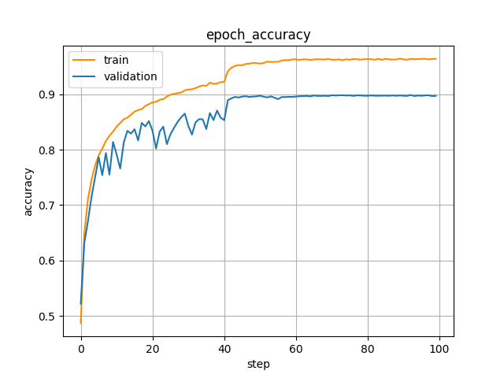
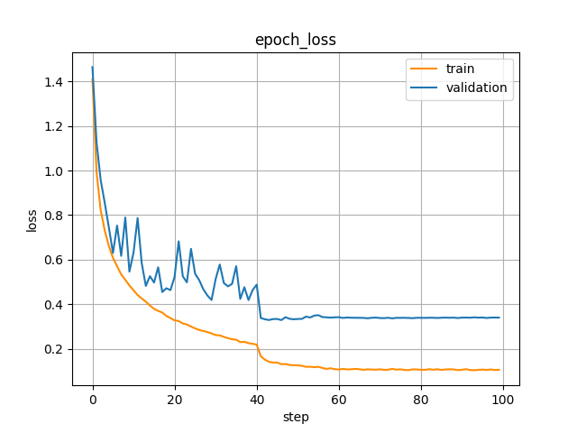
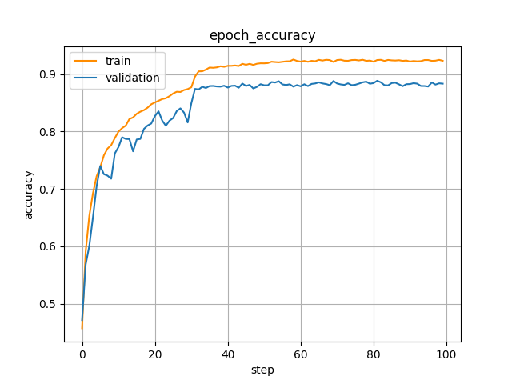
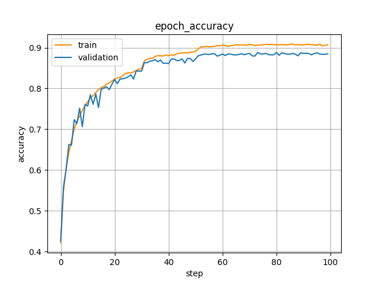
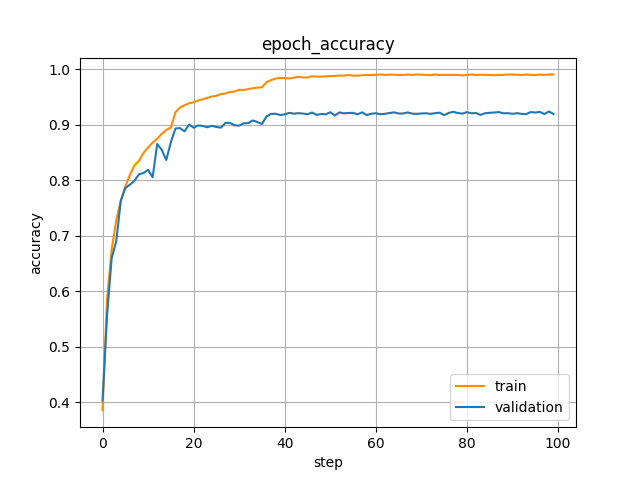
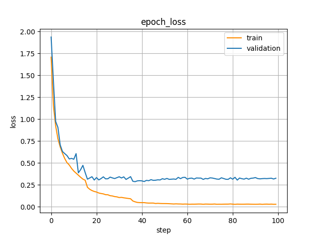
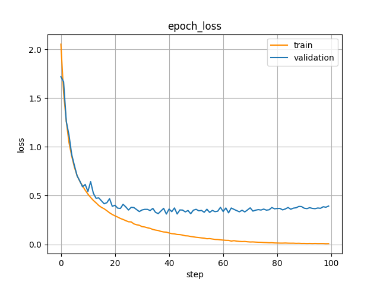
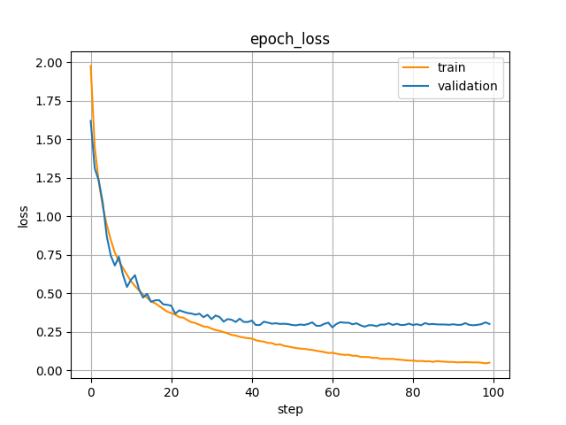

# 实验结果

本部分主要包括预测准确率，训练过程，实验调参过程及结果分析。

## 预测准确率

经过多次不同模型的尝试和参数的优化，在CIFAR-10数据集上，epoch=100时，最终模型在测试集上的准确率为92.50%，损失为0.279。

## 实验调参过程及结果分析

本部分总结了我们在实验过程中如何一步步对训练结果进行分析并进行参数和模型的优化。

最初我们参考ResNet20实现的初始模型，初始学习率的更新方法采用了分段常数衰减，学习率随着迭代次数阶梯形下降。训练过程中，训练集和验证集的学习率、准确率和损失曲线如下。

    

    
    

观察到准确率曲线有拐点，在学习率降低后，准确率迅速提高，故尝试减半学习率。

    

    
    

由于过拟合较为严重，向每一个TinyToyStack最后加入Dropout层，减少过拟合。

    
    

加入Dropout层后，过拟合问题得到缓解，但同时也导致了在测试集上预测准确率的降低，仅有88.60%，尝试重构模型。在新模型中，增大了过滤器(filter)的大小，增加了学习的参数，提高特征学习能力。

原模型：(filter, block_num): (16, 3) (32, 3) (64, 3)

新模型：(64, 2) (128, 2) (256, 2) (512, 2)

并且将Conv2D->BN->ReLU结构改为了BN->ReLU->Conv2D（preact形式）

preact的灵感来源参考[preact_paper](https://arxiv.org/abs/1603.05027)

由于是新模型，去掉了Dropout。

    

    
    

观察到准确率和损失曲线中任然存在拐点，将阶梯形学习率换为指数下降学习率，使准确率和损失曲线更平滑。

    

    
    

为防止指数下降学习率收敛太快而达到局部最优，换用余弦下降学习率。

    

    
    

降低层数，将18层的ResNet减为14层，缓解过拟合。

    

    
    

在降低层数的基础上加入更多dropout。

    

    
    

最终得到了测试集上92.50%的准确率和0.279的损失

